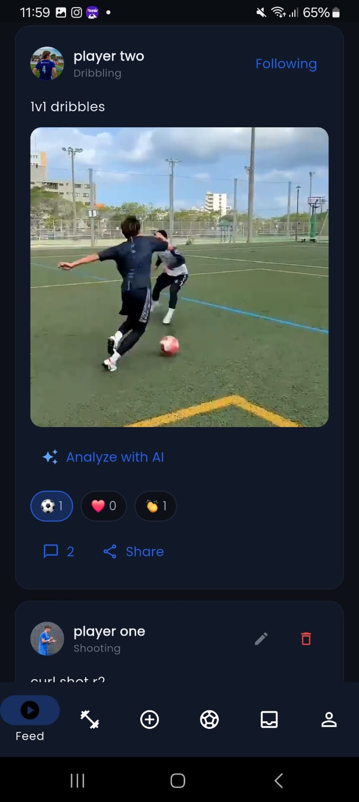
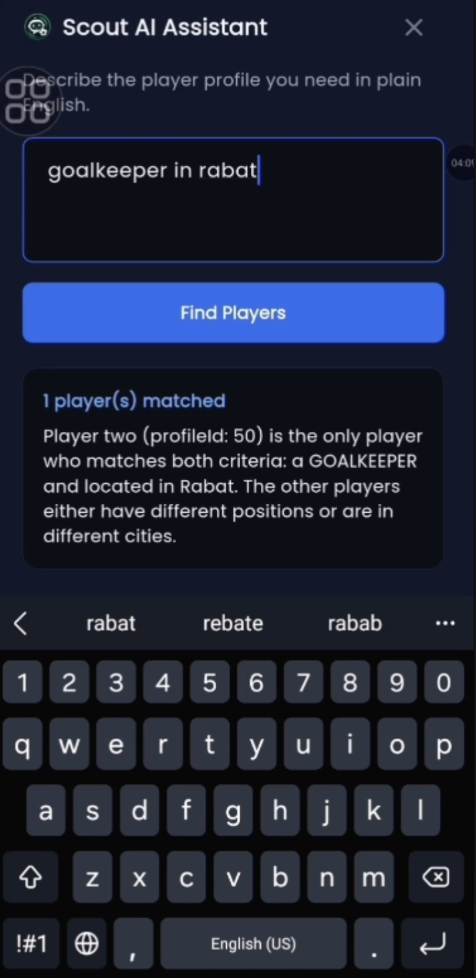
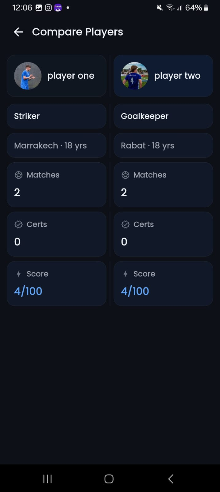

<p align="center">
  
</p>

<h1 align="center">KickPro</h1>

<p align="center">
  <strong>Digital football CV platform for players, scouts, and agents — Morocco-first.</strong>
</p>

<p align="center">
  Flutter mobile app · Spring Boot REST API · PostgreSQL · Gemini AI · Docker
</p>

---

KickPro helps young football players build a **verifiable sports profile** (skills, drills, videos, certifications, credibility score) and gives scouts and agents powerful tools to **search, compare, and evaluate** talent with AI assistance.

## Screenshots

<p align="center">
  
  &nbsp;&nbsp;
  
  &nbsp;&nbsp;
  
  &nbsp;&nbsp;
  
</p>

<p align="center">
  <em>Feed · Scout AI Assistant · AI Coach · Compare Players</em>
</p>

## Features

| Role | Highlights |
|------|------------|
| **Player** | Profile & skills, drill progression, match booking, social feed, AI coach (nutrition, drills, recovery), credibility score |
| **Scout** | Advanced search, bookmarks, side-by-side compare, **Scout AI Assistant** (natural-language player discovery) |
| **Agent** | Trials & announcements, messaging, detailed player profiles |
| **Admin** | Users, posts, drills, courses, stadiums, moderation |

## Tech stack

| Layer | Technologies |
|-------|----------------|
| Mobile | Flutter 3, Dart, Riverpod, GoRouter, Dio |
| Backend | Spring Boot 3.5, Java 21, Spring Security, JWT, JPA |
| Database | PostgreSQL 15, Redis, Apache Kafka |
| AI | Google Gemini (Spring AI + Python microservice) |
| Media | Cloudinary |
| Maps | OpenStreetMap / flutter_map |
| DevOps | Docker Compose, GitHub Actions |
| Quality | JUnit 5, Postman, SonarQube |

## Project structure

```
KickPro/
├── mobile/           # Flutter app (Android)
├── backend/          # Spring Boot REST API
├── ai-service/       # Python FastAPI + Gemini
├── assets/           # Brand assets (logo, README screenshots)
│   └── screenshots/
├── scripts/          # docker-up.sh, run-junit-tests.sh
└── docker-compose.yml
```

## Quick start

### Prerequisites

- Docker Desktop (4 GB+ RAM recommended for the backend)
- Java 21 & Maven (optional, for local backend without Docker)
- Flutter SDK (for mobile)
- `.env` at repo root (JWT secret, Cloudinary, Gemini API key)

### Run the stack

```bash
git clone https://github.com/YOUR_USERNAME/KickPro.git
cd KickPro
cp .env.example .env   # if present — fill in your keys
./scripts/docker-up.sh
```

API base URL (local): `http://localhost:8080`

### Mobile app

```bash
cd mobile
flutter pub get
flutter run --dart-define=API_BASE_URL=http://YOUR_LAN_IP:8080
```

For a release APK:

```bash
flutter build apk --dart-define=API_BASE_URL=http://YOUR_LAN_IP:8080
```

### Tests

```bash
# Backend unit tests
./scripts/run-junit-tests.sh

# Or directly
cd backend && ./mvnw test -Dtest=KickProValidationSuite,StadiumServiceImplTest,CredibilityServiceImplTest
```

## Architecture

Three-tier design:

1. **Presentation** — Flutter mobile (multi-role UI)
2. **Application** — Spring Boot REST API (JWT, RBAC, WebSocket chat)
3. **Data & services** — PostgreSQL, Redis, Kafka, Cloudinary, Gemini

## License

Private / academic project — see repository owner for usage terms.
